# FraudShield – Real-Time UPI Transaction Risk Analysis Engine

FraudShield is a full-stack, real-time UPI transaction risk analysis dashboard. The project features a high-performance **C++ backend** (TCP socket server, custom JSON parser, memory-indexed DSA engines, and Win32 threads) and a **premium, glassmorphic HTML/CSS/JS frontend** inspired by premium fintech dashboards.

---

## 🏗️ System Architecture & Data Flow

### 1. High-Level Architecture Diagram
```mermaid
graph TD
    subgraph Frontend (Browser)
        UI[HTML5/CSS3 Dashboard] <--> JS[index.js API Controller]
        JS -->|Chart rendering| CJS[Chart.js Engine]
    end

    subgraph Backend (C++ Executable)
        Server[server.cpp Winsock Listener] <--> Router[HTTP Request Router]
        Router -->|Serves Static Assets| FE_Files[index.html / CSS / JS]
        Router -->|REST JSON API| API[API Endpoint Handlers]
        
        API <--> Engine[models.h RiskEngine]
        Engine <--> Profiler[UserProfile Manager]
        Engine <--> Heap[Custom MaxHeap Leaderboard]
        
        API <--> DB[database.h Persistence Layer]
    end

    subgraph Disk Storage
        DB <--> Users_JSON[(users.json)]
        DB <--> Tx_JSON[(transactions.json)]
    end
```

### 2. Transaction Processing Data Flow

```mermaid
sequenceDiagram
    participant User as UPI Client
    participant Server as server.cpp (Port 8080)
    participant Engine as models.h (RiskEngine)
    participant Profiles as models.h (UserProfile)
    participant DB as database.h (JSON Storage)

    User->>Server: HTTP POST /api/transactions (JSON Payload)
    Note over Server: Read Content-Length & Body<br/>Spawn Win32 worker thread
    Server->>Engine: evaluateTransaction(tx)
    
    rect rgb(20, 30, 45)
        Note over Engine: Lookup UserProfile by VPA (O(1) HashMap)
        Engine->>Engine: Check Amount Anomaly (vs User Profile Avg)
        Engine->>Engine: Slide Time Window (Evict older than 10 mins from Deque)
        Engine->>Engine: Count transactions in 5 mins (Velocity check)
        Engine->>Engine: Count unique receivers in 10 mins (Mule check)
        Engine->>Engine: Evaluate Device/Location anomalies
        Engine->>Engine: Calculate Negative Weights (Risk reduction match)
        Note over Engine: Sum weights & Cap Score (0-100)
    end
    
    Engine-->>Server: Returns evaluated transaction (risk score & reasons)
    Server->>Engine: commitTransaction(tx)
    Note over Engine: Append transaction to history vector<br/>Update UserProfile habits incrementally (O(1))
    Server->>DB: saveAll() -> write to disk
    Server-->>User: HTTP 200 OK (risk breakdown payload)
```


---

## 💡 DSA Core Deep Dive (Interview Guide)

If asked by a recruiter to explain the DSA designs in your project, use these technical talking points:

### 1. Hash Maps (`std::unordered_map`)
*   **Usage:**
    1.  `userMap`: Maps customer UPI ID (string) $\rightarrow$ `User` info ($O(1)$ lookup).
    2.  `userHistory`: Maps UPI ID $\rightarrow$ `std::vector<Transaction>` history ($O(1)$ lookup).
    3.  `userProfiles`: Maps UPI ID $\rightarrow$ `UserProfile` habits ($O(1)$ lookup).
*   **Why?** UPI payment addresses (VPA) are unique identifiers. Using Hash Maps allows us to retrieve customer data, write new transaction histories, and update behavioral habits instantly.

### 2. Double-Ended Queue (`std::deque`) & Sliding Window
*   **Usage:** Tracks transactions within the sliding window time interval in `recentQueue`.
*   **Why?** A regular queue only allows push-back and pop-front. A vector allows random access but is slow to erase from the front ($O(N)$). 
*   **Mechanism:** `std::deque` allows $O(1)$ push-back and $O(1)$ pop-front. On a new transaction, we slide the window by popping transactions older than 10 minutes from the front of the deque and push the current transaction to the back. We then scan this sliding window to compute transaction velocity and unique receivers in $O(k)$ time (where $k \ll N$, representing only recent transactions).

### 3. Custom Binary Max-Heap (`MaxHeap`)
*   **Usage:** Maintains a ranked leaderboard of the top suspicious users.
*   **Why?** Sorting all registered accounts on every transaction takes $O(N \log N)$ time, which degrades performance at scale.
*   **Mechanism:** By coding our own array-backed binary tree with parent-child indexing (`(i-1)/2`, `2i+1`, `2i+2`), we retrieve the most suspicious account in $O(1)$ time, and insert or extract elements in $O(\log N)$ time. Implementing this from scratch (with `heapifyUp` and `heapifyDown`) demonstrates low-level systems and algorithmic capabilities.

---

## 🔍 Explainable Fraud Risk Scoring Model

The `RiskEngine` calculates risk scores dynamically. An anomaly adds points, while matching standard behaviors subtracts points, reducing false positives:

### Positive Risk Flags (Anomalies)
*   **Amount Anomaly:** $> 3\times$ user average (`+20`), $> 5\times$ (`+35`), $> 10\times$ (`+50`).
*   **Velocity (5 Min):** $> 3$ transactions (`+15`), $> 5$ transactions (`+30`).
*   **Mule Risk (10 Min):** $> 2$ unique receivers (`+15`), $> 4$ unique receivers (`+30`).
*   **New Receiver:** Target UPI not in historic transaction set (`+15`).
*   **Device Anomaly:** Current device $\neq$ last transaction device (`+20`).
*   **Location Anomaly:** Current city $\neq$ last transaction city (`+25`).
*   **Time/Hour Anomaly:** Late-night hour (11 PM - 5 AM) that is uncharacteristic for this user (`+10`).

### Negative Risk Reductions (False-Positive Prevention)
*   **Trusted Contact:** Sending to a recipient who has $\ge 3$ transactions (`-20` points).
*   **Normal Size Match:** Transaction amount is within 25% of user's average (`-15` points).
*   **Device Consistency:** Same device as previous transaction (`-10` points).
*   **Location Consistency:** Same location as previous transaction (`-10` points).

---

## 🎓 Placement Prep Q&A (Interview Cheat-Sheet)

Here are the top 12 questions recruiters ask about this system during placements:

#### Q1: Why did you choose C++ for the backend rather than Java, Python, or Node.js?
*   **Answer:** Real-time fraud detection in high-frequency trading or payment gateways demands sub-millisecond execution latencies. C++ provides deterministic memory management, zero-overhead abstractions, and compile-time optimizations. By writing it in C++, we eliminate garbage collection pauses (common in Java/Go) and interpreter slowness (Python), executing risk calculations in under 0.05 milliseconds.

#### Q2: You didn't use an external database like MySQL or MongoDB. How does this system persist data?
*   **Answer:** I implemented a custom persistence layer in `database.h` that reads/writes to `users.json` and `transactions.json` files using standard stream libraries (`std::fstream`). During boot, the system parses the JSON strings using a custom-written recursive descent parser, and loads all users and transactions sequentially. This design keeps the project entirely self-contained, avoiding third-party installation overhead.

#### Q3: How do you build user behavioral profiles dynamically without writing a massive, complex database?
*   **Answer:** On startup, as the transactions are loaded chronologically from `transactions.json` and committed to the `RiskEngine`, the `updateProfile()` function is triggered for each transaction. This dynamically calculates and builds the `UserProfile` (running average, limits, hourly heatmaps, trusted contact maps) in memory. This eliminates database synchronization issues and ensures the memory is always in sync with the ledger history.

#### Q4: What is the time complexity of updating the user's running transaction average? Do you recalculate it by scanning all transactions?
*   **Answer:** Recalculating the average by iterating over all historical transactions would be $O(N)$ and degrade performance. Instead, I use an **incremental rolling average formula** inside `updateProfile()`:
    $$\text{Average}_{\text{new}} = \text{Average}_{\text{old}} + \frac{\text{Amount}_{\text{new}} - \text{Average}_{\text{old}}}{\text{Count}_{\text{total}}}$$
    This takes $O(1)$ constant time, requiring only the previous average, the new amount, and the transaction count.

#### Q5: Explain how the Sliding Window algorithm is implemented in your project.
*   **Answer:** We maintain a `std::deque<Transaction>` of recent transactions per user. When a new transaction arrives, we compare its timestamp with the transaction at the front of the deque. If the time difference exceeds 10 minutes (600 seconds), we remove the old transaction from the front (`pop_front()`). We repeat this until the front transaction is within the 10-minute window. We then append the new transaction to the back (`push_back()`). This ensures the deque represents a rolling window of recent events in $O(1)$ amortized time.

#### Q6: Why did you implement a custom Binary Max-Heap instead of using `std::priority_queue`?
*   **Answer:** C++'s `std::priority_queue` is a black box that conceals the underlying heap logic. In technical interviews, recruiters want to evaluate your understanding of tree balance and array representations. By writing a custom `MaxHeap` class backed by a `std::vector`, I demonstrated parent-child index mapping ($2i+1$ and $2i+2$), and the algorithms for `heapifyUp` (bubble up) and `heapifyDown` (sink down) which execute in $O(\log N)$ time.

#### Q7: How does your system prevent false positives for late-night transactions?
*   **Answer:** Static rules flag all late-night transactions (11 PM - 5 AM) as suspicious. In FraudShield, the system utilizes **Hour Anomaly Profiling**. When a user transacts, we increment their hour count in a 24-hour histogram (`hourlyTxCounts`). If the user has $\ge 5$ transactions, we check if they have transacted during this hour historically. If yes, we bypass the late-night risk flag. Additionally, if they send to a trusted contact (frequency $\ge 3$) on their regular device, the score gets negated by up to `-40` points, keeping the transaction `SAFE`.

#### Q8: How does your C++ server handle multiple clients simultaneously without blocking?
*   **Answer:** In `server.cpp`, when a client connection is accepted via `accept()`, rather than processing it sequentially in the main thread, the server spawns a native Windows worker thread using the `CreateThread` API, passing the client socket handle. The thread runs `handleClient()` independently and terminates when done, leaving the main thread free to accept new connections immediately.

#### Q9: What is the benefit of using a custom JSON parser instead of a library like nlohmann/json?
*   **Answer:** While `nlohmann/json` is robust, it requires downloading headers and setting up compile includes. Implementing a custom token-scanning recursive-descent parser inside `utils.h` shows deep compiler-design understanding (handling braces, brackets, colons, escapes, and datatypes). It makes the project 100% self-contained and easy to compile.

#### Q10: How does your RiskEngine detect a "Money Mule" dispersion pattern?
*   **Answer:** Money mules act as intermediaries, receiving stolen funds and rapidly distributing them to multiple accounts. The RiskEngine detects this using the sliding window deque. Within a rolling 10-minute window, we extract the unique receiver UPIs. If a user transfers money to more than 2 unique receivers within that 10 minutes, we trigger a multiple receiver alert (`+15`). If it exceeds 4 unique receivers, it adds `+30` points.

#### Q11: What is the time complexity of calculating the Leaderboard?
*   **Answer:** To calculate the leaderboard, we iterate over all registered users ($O(U)$). For each user, we find their maximum risk score and fraud count from history ($O(T_u)$). We then insert their summary into our Max-Heap ($O(\log U)$). The total time complexity is $O(U \cdot T_u + U \log U)$. Since the heap contains only active suspicious users, the tree depth is small, making execution nearly instantaneous.

#### Q12: How would you scale this architecture to support millions of transactions per second?
*   **Answer:** To scale:
    1.  **Distributed Hashing:** Partition user records across multiple nodes (Sharding) based on VPA hash value.
    2.  **In-Memory Caching:** Keep active user profiles in distributed memory caches like Redis.
    3.  **Asynchronous Storage:** Commit evaluations in memory immediately, and write to disk asynchronously using message queues (e.g. Apache Kafka) to prevent disk I/O bottlenecks.
    4.  **Load Balancing:** Deploy a cluster of C++ worker nodes behind a load balancer to distribute Winsock traffic.
